## Python 
Python是一种解释型脚本语言，可以应用于以下领域:
- Web 和 Internet开发
- 科学计算和统计
- 教育
- 桌面界面开发
- 软件开发
- 后端开发
### 安装环境
```
windows10、windows8
python3
```
### 目录结构
- windows系统中下载python安装包
- 安装python环境
- 检测是否安装成功
- 在环境变量中添加python

### 一、windows系统中下载python安装包
#### 1、方法1（推荐）
打开[python官网](https://www.python.org/),在首页中选择下载
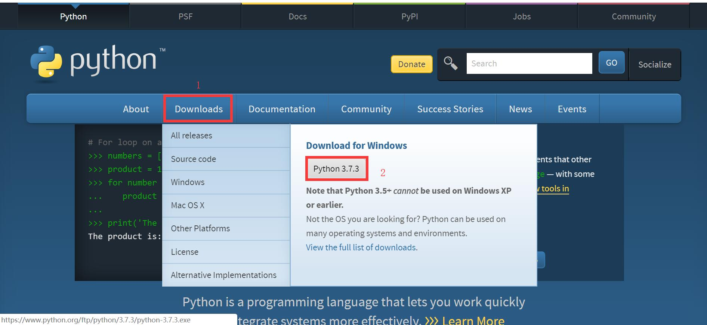
#### 2、方法2
链接：https://pan.baidu.com/s/1I-J7b7OZV8fSdOYBf55ToQ 
提取码：j0xr 
打开百度云网盘选择 python3.7.3.exe下载
### 二、安装python环境
运行python3.7.3.exe文件，python安装包在安装完成之后请妥善保存，不建议删除，后续的维护、卸载都可以使用。安装时请勾选"Add Python3.7 to PATH"，勾选一般可省略此教程中第四步。安装完成之后选择 close关闭即可。
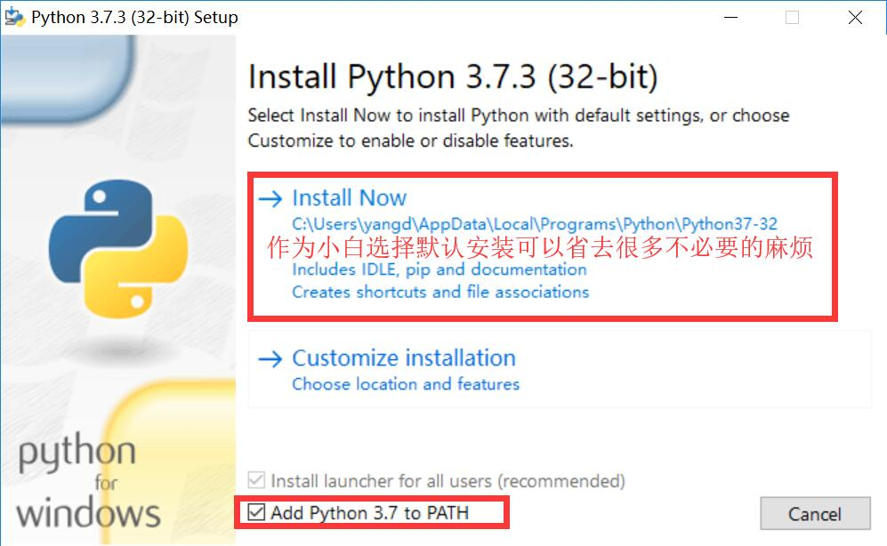
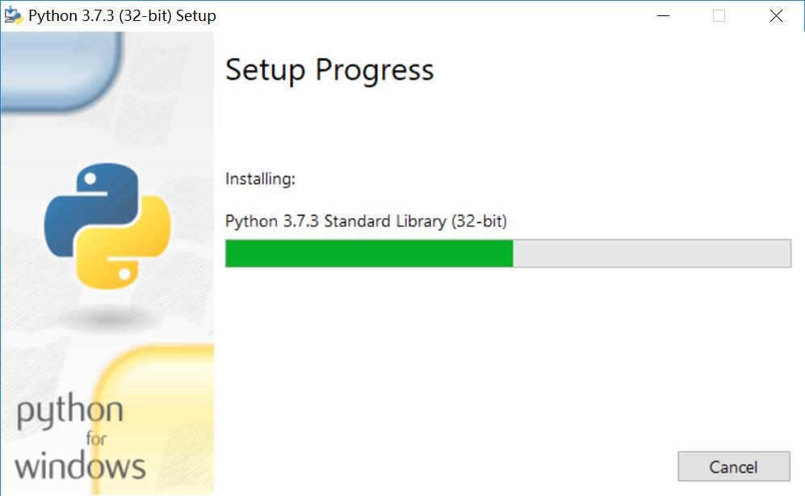


### 三、检测是否安装成功
运行 windows键+R ,输入cmd
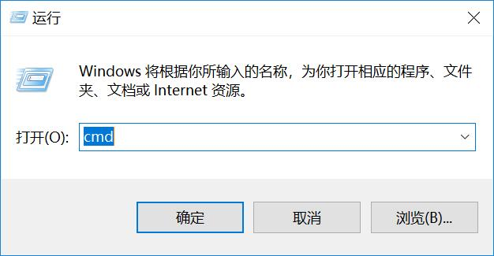
在终端运行 python
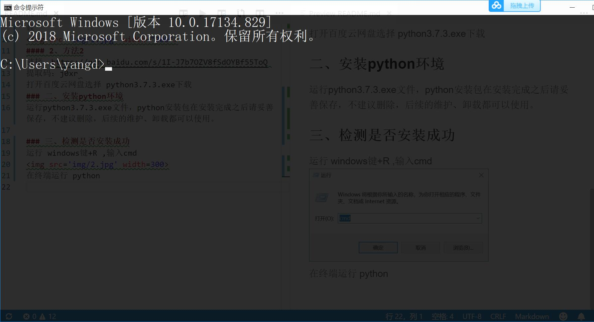
如果出现如下内容代表安装成功
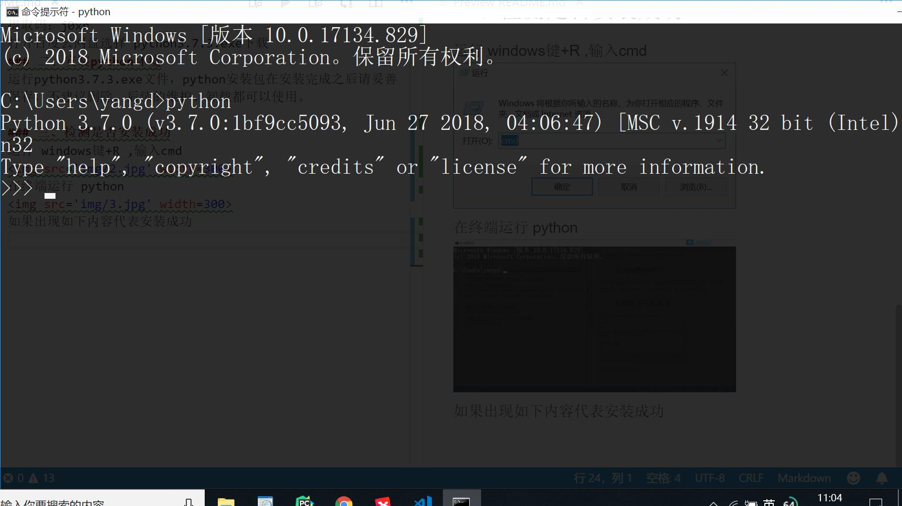
如未出现此内容，代表python没有添加到系统[环境变量](https://baike.baidu.com/item/%E7%8E%AF%E5%A2%83%E5%8F%98%E9%87%8F/1730949?fr=aladdin)中,请继续执行 四、在环境变量中添加python

### 四、在环境变量中添加python
在我的电脑中"右击"点击属性，在弹出窗口中选择"高级系统设置"，在系统属性窗口中选择"环境变量"，在环境变量弹窗中选择"Path",在编辑环境变量弹窗中选择“新建”，然后将python所在目录进行添加
```
# 如是采用默认安装，python、pip安装目录如下
#pip目录:  
C:\Users\【你的计算机名】\AppData\Local\Programs\Python\Python35\Scripts\
#python目录:  
C:\Users\【你的计算机名】\AppData\Local\Programs\Python\Python35\Scripts\
```
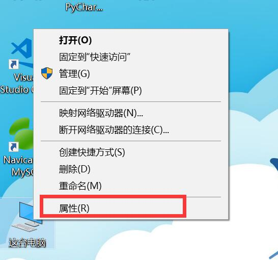
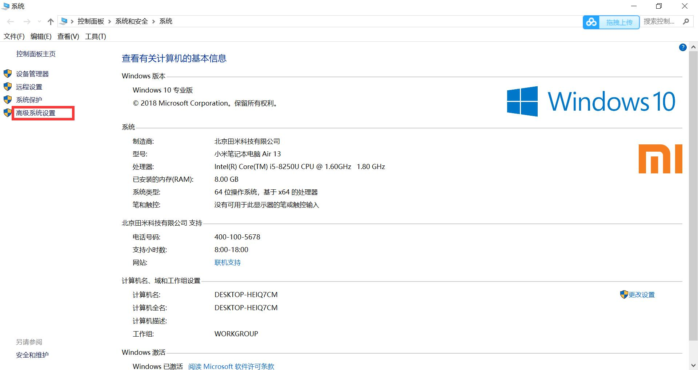
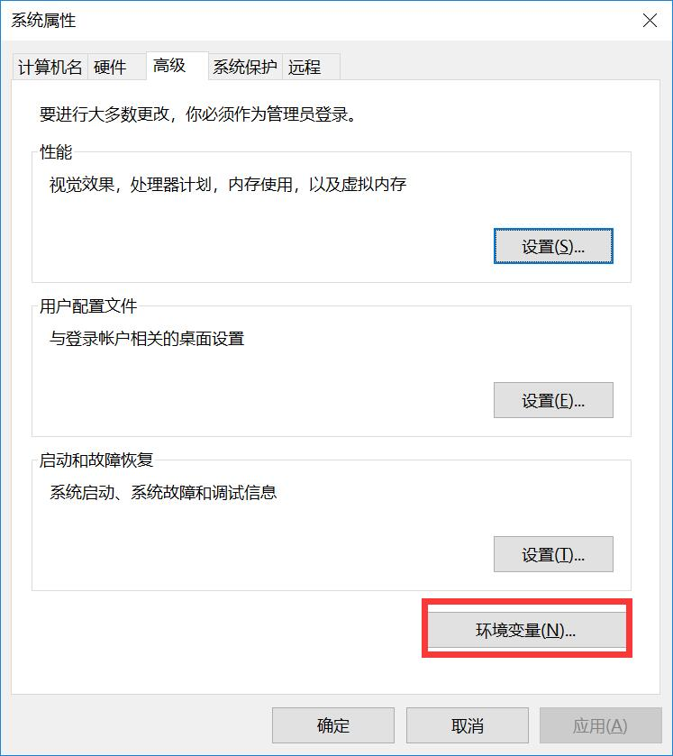
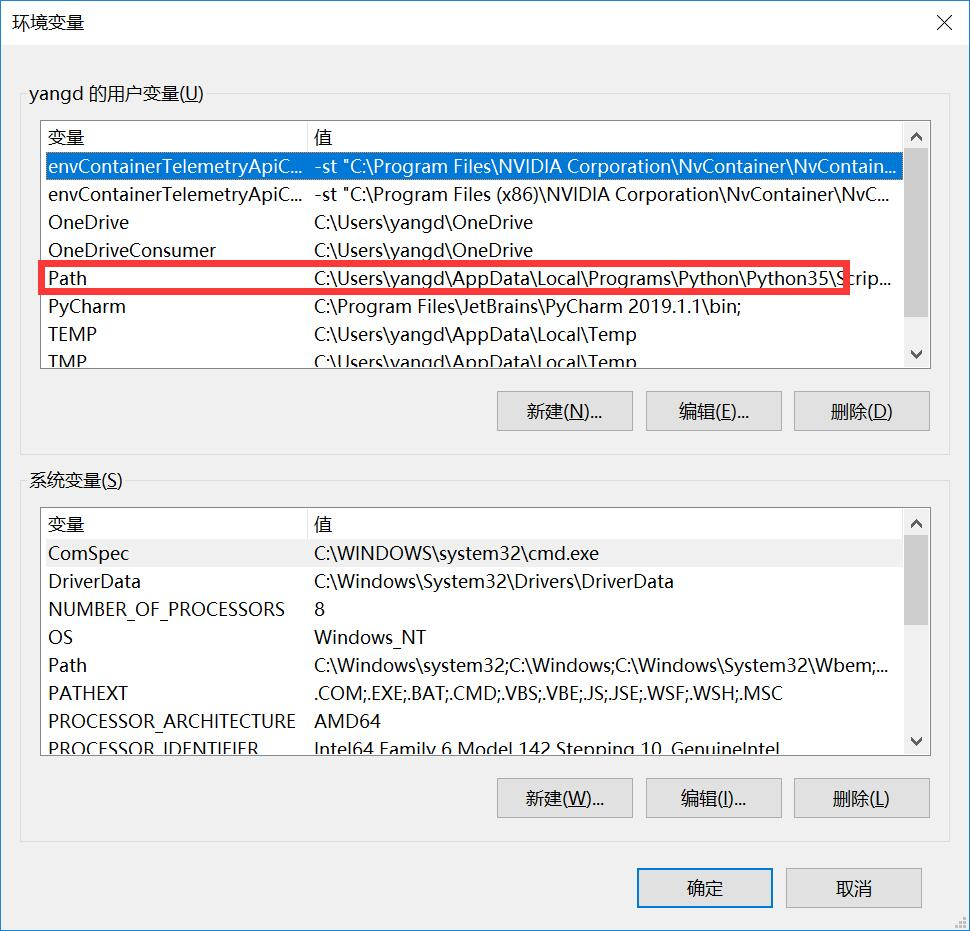
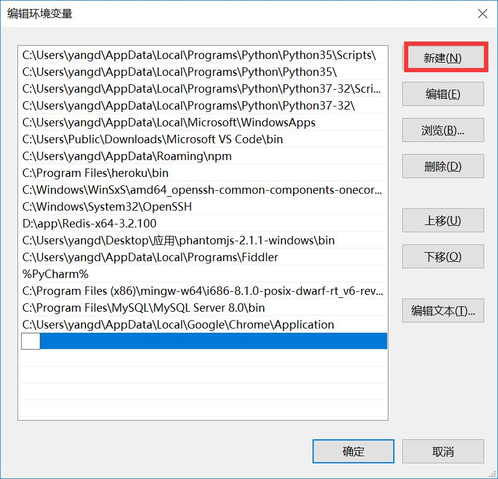

